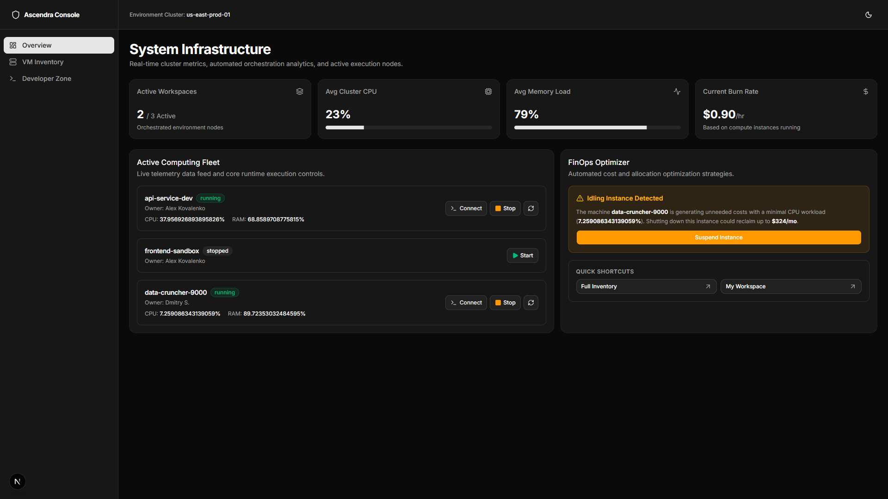

# Ascendra Workspaces Dashboard



https://ascendra-dashboard-wijn.vercel.app/

A cloud infrastructure management platform designed for two distinct user groups: developers managing their own virtual environments and DevOps administrators monitoring resource usage and costs across the entire virtual machine fleet.

Built using Next.js, shadcn/ui, Tailwind CSS, and a client-side backend powered by React Context.

To complete this project, I followed the article:

https://designrevision.com/blog/shadcn-dashboard-tutorial

The article implements a similar dashboard concept but uses different metrics and datasets.

---

## Step 1 — Project Setup (Adapted from Tutorial Step 1)

The article uses `npx shadcn-ui@latest init`. The current CLI has been migrated to `npx shadcn@latest init`.

During initialization, we selected:

Component Library: Radix (shadcn's default implementation instead of Base UI)
 Preset: Nova — Lucide / Geist (modern icon set, clean design, aligned with shadcn.com documentation)
 Style: Default (strict and minimalistic, suitable for a DevOps tool handling large volumes of data)
 Base Color: Zinc

Components were installed with a single command:

```bash
npx shadcn@latest add card table chart sidebar button input separator \
  badge progress sheet tabs avatar dropdown-menu command tooltip
```

### Tutorial Structure → Our Structure

**Tutorial (Typical SaaS Application)**

```text
app/dashboard/customers/          → app/dashboard/admin/inventory/
app/dashboard/settings/           → app/dashboard/developer/
components/dashboard/sidebar.tsx  → components/dashboard/shell.tsx
```

---

## Step 2 — Domain Types (Not Included in the Tutorial but Required for the Assignment)

The technical specification explicitly requires TypeScript types for all domain models.

We created them in:

```text
src/types/infrastructure.ts
```

before writing any UI code.

This single file acts as a contract between the mock backend layer and all UI components. No business data is hardcoded inside page components.

---

## Step 3 — Mock Backend Using React Context (Replacing the Tutorial's Static Data)

In the tutorial, values are hardcoded directly inside components:

```tsx
value="$45,231"
```

The assignment explicitly requires a proper data layer with loading, error, and empty states.

To satisfy this requirement, I implemented a client-side mock backend in:

```text
src/context/AppStateContext.tsx
```

### Features

 Stores virtual machines and templates in `useState`
`startVM`, `stopVM`, and `restartVM` use a two-step `setTimeout` pattern to simulate asynchronous orchestration: status changes to `starting` immediately, then to `running` after 2.5 seconds
 `cpuUsagePercent` and `memoryUsagePercent` values fluctuate randomly every 4 seconds through `setInterval` for running machines, creating the feel of a real-time monitoring dashboard
Wrapped at the root level in `app/layout.tsx` alongside the `ThemeProvider`

```tsx
const startVM = (id: string) => {
  setVms((prev) => prev.map((vm) =>
    vm.id === id ? { ...vm, status: "starting" } : vm
  ));

  setTimeout(() => {
    setVms((prev) => prev.map((vm) =>
      vm.id === id
        ? {
            ...vm,
            status: "running",
            cpuUsagePercent: 15,
            memoryUsagePercent: 30
          }
        : vm
    ));
  }, 2500);
};
```

---

## Step 4 — Dashboard Shell (Replacing Tutorial Step 3 Sidebar)

The tutorial describes manually building a sidebar using `hidden md:block` and a separate mobile `Sheet` component.

The current shadcn CLI includes an official Sidebar primitive with built-in collapsing support.

We implemented a custom `DashboardShell` component (`src/components/dashboard/shell.tsx`) that:

Displays a permanent desktop `<aside>` (hidden on mobile with `hidden md:flex`)
Wraps the mobile trigger inside a shadcn `Sheet` drawer
Uses `usePathname()` to highlight the active route
Includes a dark/light theme toggle in the header

### Navigation

```tsx
const menuItems = [
  { title: "Overview", href: "/dashboard", icon: LayoutDashboard },
  { title: "VM Inventory", href: "/dashboard/admin/inventory", icon: Server },
  { title: "Developer Zone", href: "/dashboard/developer", icon: Terminal },
];
```

This component wraps all dashboard routes through:

```text
app/dashboard/layout.tsx
```

It does not redefine `<html>` or `<body>` elements, as those belong exclusively to the root layout.

(Duplicating these elements caused hydration mismatches, which were resolved by removing them from the nested layout.)

---

## Step 5 — KPI Cards (Adapted from Tutorial Step 4)

The tutorial uses static properties:

```tsx
// article example — hardcoded
<MetricCard
  title="Total Revenue"
  value="$45,231"
  change="+20.1%"
  trend="up"
/>
```

These were replaced with values calculated directly from live application state:

```tsx
// our version — computed from live state
const activeVMs = vms.filter((vm) => vm.status === "running").length;

const totalHourlyCost = vms
  .filter(v => v.status === "running")
  .reduce((s, v) => s + v.hourlyCost, 0);

const avgCpu = runningVMs.length
  ? Math.round(...)
  : 0;
```

We also replaced the tutorial's textual trend description ("since last month") with CPU and memory `<Progress>` indicators, which provide a more meaningful representation of infrastructure utilization.

The `MetricCard` component was refactored to accept a generic `description` property instead of the hardcoded "last month" string because infrastructure metrics operate on minutes and hours rather than monthly reporting periods.

---

## Step 6 — Virtual Machine Inventory Table (Adapted from Tutorial Step 5)

The tutorial defines a `Customer` type consisting of:

```text
name
email
status
revenue
```

We replaced it with our `VM` domain type.

### Key Differences from the Tutorial Table

Status badges use alpha-based color variants (`bg-emerald-500/10`, `border-amber-500/20`) instead of the default shadcn `variant`, providing stronger visual differentiation between running, stopped, and error states without overriding global theme tokens.
Idle machine detection is built directly into the interface. Machines running with `cpuUsagePercent < 10` receive a visual idle indicator.
Search and filtering are implemented using `useMemo` against the context-managed VM collection, eliminating the need for external libraries at this scale.
The Actions column contains `Power` and `PowerOff` controls with context-aware hover states and animated "Waiting..." feedback during state transitions.

### Empty State

If a search returns no results, a centered message is displayed instead of rendering an empty table.

---

## Step 7 — Developer Zone

This page is unique to the project and has no equivalent in the original tutorial.

It filters the virtual machine collection to display only:

```tsx
ownerId === "u-01"
```

for the current session user, ensuring that developers see only their own environments.

### Each Virtual Machine Card Includes

 Real-time CPU and memory utilization indicators using `Progress` components (visible only when the VM status is `running`)
 A **Connect** button that opens `https://vscode.dev` in a new tab (placeholder for a future self-hosted VS Code Server URL)
 Lifecycle controls powered by the same state machine used throughout the dashboard
 A stopped-state placeholder containing instructions for starting the environment

---

## Step 8 — Typography Improvements (Final Polish)

The tutorial and default shadcn configuration recommend Geist.

We switched to **Inter + JetBrains Mono** because:

Inter provides better readability for dense data tables at smaller font sizes.
JetBrains Mono offers excellent support for operator ligatures and symbols commonly found in infrastructure metrics (`→`, `≥`, `%`, ranges).


# Architecture Development Roadmap

## Integration of a full-fledged REST API (Next.js Route Handlers)

Move the business logic for managing virtual machine lifecycles (Start/Stop/Restart button clicks) from the local client state to Next.js server endpoints for handling asynchronous operations.

## Establishing persistent data storage using Supabase

Integration of the Supabase cloud platform (PostgreSQL) for long-term storage of instance configurations, relationships between machines and their owners, and persistence of node state logs.

## Optimization of live telemetry collection using polling strategies
Replacing the current client-side simulation with the SWR / React Query library. This will allow you to fetch relevant metrics (CPU/RAM) from the backend in the background at a fixed interval (e.g., every 3-5 seconds), ensuring data freshness without complicating the architecture.

# Why is Next.js and Supabase a great combination for this project?

## A real backend in 5 minutes

You don't need to set up database hosting or write hundreds of lines of security configuration. Supabase deploys a full-fledged PostgreSQL in the cloud with all the ready-made interfaces.

## Painless WebSockets Replacement

Supabase has a built-in Supabase Realtime mechanism. If in the future you still need graphs to be updated on the fly without constant queries, you can subscribe to database changes with literally one line of code (`.on('postgres_changes', ...)`), and Supabase will configure web sockets for you under the hood. Skill in working with this tool is highly valued in modern web development.
